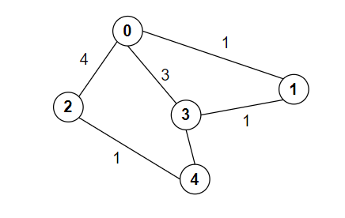

# 图最短路径算法
## 问题介绍
一个带权重的无向图中寻找从`src`到`dest`的最短路径的算法；
示例图形如下：

节点0到节点4的最短路径为：
`0 -> 2 -> 4` ，路径长度为5

## Dijstra 算法

### 算法介绍
迪杰斯特拉算法又称标号法，中心思想是：
1. 将所有的节点划分成 `visted` 和 `notVisted` 两部分，其中`visited`中的节点表示当前已经确定了从`src`到该节点的最短路径
2. 初始时 `visted` 只包含源节点`src`
3. 每一轮从`visted`中所有节点可以访问到的节点中选一个到`src`最近的一个节点，并将其加入到`visted`，同时更新这些能访问到的节点到`src`的距离
4. 如果dest也加入到了`visted` 那么算法结束

针对算法过程如下：
1. 根据边集合创建distance数组, 访问不到的标记成x

|    | 0 | 1 | 2 | 3 | 4 |
|--  |-- |-- |-- |-- |-- |
| 0  | 0 | 1 | 4 | 3 | x |  
| 1  | 1 | 0 | x | 1 | x |  
| 2  | 4 | x | 0 | x | 1 |  
| 3  | 3 | 1 | x | 0 | 3 |  
| 4  | x | x | 1 | 3 | 0 |  

2. 当前`visted = [0]`;能访问到的节点有`[1,2,3]`;其中距离最短的是`0 -> 1`; `visted` 更新为 `[0, 1]`

|    | 0 | 1 | 2 | 3 | 4 |
|--  |-- |-- |-- |-- |-- |
| 0  | 0 | 1 | 4 | 3 | x |  
| 1  | 1 | 0 | x | 1 | x |  
| 2  | 4 | x | 0 | x | 1 |  
| 3  | 3 | 1 | x | 0 | 3 |  
| 4  | x | x | 1 | 3 | 0 |  

3. 当前`visted = [0, 1]`;能访问到的`notVisted`节点有`[2,3]`;其中距离最短的是`0 -> 1 -> 3`，长度为2; `visted` 更新为 `[0, 1, 3]`; 同时`distance[0][3]` 和 `distance[3][0]`更新为 2

|    | 0 | 1 | 2 | 3 | 4 |
|--  |-- |-- |-- |-- |-- |
| 0  | 0 | 1 | 4 | <b>2<b> | x |  
| 1  | 1 | 0 | x | 1 | x |  
| 2  | 4 | x | 0 | x | 1 |  
| 3  | <b>2<b> | 1 | x | 0 | 3 |  
| 4  | x | x | 1 | 3 | 0 |  

4. 当前`visted = [0, 1, 3]`;能访问到的`notVisted`节点有`[2,4]`;其中距离最短的是`0 -> 2`，长度为4; `visted` 更新为 `[0, 1, 3, 2]`; 这一轮没有更新距离

5. 当前`visted = [0, 1, 3, 2]`;能访问到的`notVisted`节点有`[4]`;其中距离最短的是`0 -> 2 -> 4`，长度为5; `visted` 更新为 `[0, 1, 3, 2, 4]`; 

6. `dest` 已经访问到了，结果为`distance[src][dest]`

### 复杂度

空间复杂度为 `O(n^2)`
假设有`n`个节点，最坏情况下，最后一个访问到`dest`，共需要访问`n-1`轮，每一轮需要遍历`visted`节点中的节点能访问到的所有节点，未优化时时间复杂度为`O(n^2)`

## Ford 算法

### 算法介绍

